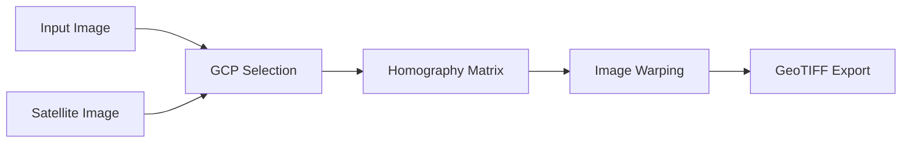

# 🌍 Manual GCP Georeferencing Tool

<div align="center">


**A desktop application for georeferencing aerial/drone images using Ground Control Points (GCPs)**

[Features](#-features) • [Installation](#️-installation) • [Usage](#-usage) • [Examples](#-examples) • [FAQ](#-faq)

</div>

---

## 📋 Table of Contents

- [Overview](#-overview)
- [Features](#-features)
- [Installation](#️-installation)
- [Quick Start](#-quick-start)
- [Detailed Usage](#-detailed-usage)
- [Technical Details](#-technical-details)
- [Use Cases](#-use-cases)
- [Tips & Best Practices](#-tips--best-practices)
- [Troubleshooting](#-troubleshooting)
- [Roadmap](#-roadmap)
- [Contributing](#-contributing)
- [License](#-license)

---

## 🎯 Overview

Transform non-georeferenced images (historical aerial photos, drone imagery, or scanned maps) into georeferenced GeoTIFF files compatible with GIS software like QGIS and ArcGIS.

### What is Georeferencing?

Georeferencing assigns real-world coordinates to an image, enabling spatial analysis and overlay with other geographic data.

---

## ✨ Features

- ✅ **KML/KMZ Support** - Load boundary files directly from Google Earth
- ✅ **Automatic Satellite Download** - Fetches reference imagery from Google Maps
- ✅ **Side-by-Side Interface** - Interactive point selection on dual canvases
- ✅ **Flexible Transformation** - Perspective (4 points) or Homography (4+ points with RANSAC)
- ✅ **GeoTIFF Export** - Properly georeferenced output with WGS84 coordinate system
- ✅ **Multi-Format Support** - JPG, PNG, TIFF input images

---

## 🛠️ Installation

### Prerequisites

```bash
Python 3.8 or higher
```

### Step 1: Clone the Repository

```bash
git clone https://github.com/yourusername/georeferencing-tool.git
cd georeferencing-tool
```

### Step 2: Install Dependencies

#### Using pip

```bash
pip install -r requirements.txt
```

#### Manual Installation

```bash
pip install pillow numpy opencv-python rasterio requests
```

#### For macOS Users

If `tkinter` is not available:

```bash
brew install python-tk@3.11
```


---

## 🚀 Quick Start

### 1. Prepare Your Data

- **KML/KMZ file**: Create a boundary polygon in Google Earth
- **Input image**: Your aerial/drone photo (JPG, PNG, or TIFF)

### 2. Run the Application

```bash
python app.py
```

### 3. Three-Step Workflow

| Step | Action | Description |
|------|--------|-------------|
| **1** | Load KML/KMZ | Automatically downloads satellite reference image |
| **2** | Load Image | Select your input image to georeference |
| **3** | Mark Points | Click matching points on both images (min. 4 pairs) |
| **4** | Apply | Export georeferenced GeoTIFF |

---

## 📖 Detailed Usage

### Interface Overview

```
┌─────────────────────────────────────────────────────────────┐
│  [1. Select KML/KMZ]  [2. Select Image]  [Clear]  [Apply]  │
└─────────────────────────────────────────────────────────────┘
┌───────────────────────────┬───────────────────────────────┐
│                           │                               │
│    Input Image            │    Satellite Image            │
│    (Your Photo)           │    (Reference)                │
│                           │                               │
│    Points: 4              │    Points: 4                  │
│                           │                               │
└───────────────────────────┴───────────────────────────────┘
┌─────────────────────────────────────────────────────────────┐
│  Status: Ready to georeference (4 point pairs)              │
└─────────────────────────────────────────────────────────────┘
```

### Selecting Ground Control Points (GCPs)

**Good GCP locations:**
- 🏢 Building corners
- 🛣️ Road intersections
- 🌉 Bridge endpoints
- ⛲ Permanent landmarks

**Point distribution:**
```
┌─────────────────┐
│ 1             2 │  ← Cover all corners
│                 │
│                 │
│                 │
│ 4             3 │
└─────────────────┘
```

### Keyboard Shortcuts

> **Note:** Currently manual workflow only. Keyboard shortcuts coming soon!

---

## 📐 Technical Details

### Coordinate Systems

| Component | CRS | Details |
|-----------|-----|---------|
| **Output** | WGS84 (EPSG:4326) | Standard GPS coordinates |
| **Satellite Tiles** | Google Maps | Zoom level 17 (±4.77m/pixel) |

### Transformation Pipeline



### Algorithms Used

- **4 points**: `cv2.getPerspectiveTransform()` - Direct perspective transformation
- **5+ points**: `cv2.findHomography()` with RANSAC - Robust outlier rejection

### Image Processing Steps

1. Load and normalize images
2. Collect GCP pairs from user clicks
3. Convert display coordinates to image coordinates
4. Calculate transformation matrix
5. Warp input image to match satellite geometry
6. Export with geospatial metadata

---

## 🎯 Use Cases

| Use Case | Description | Example |
|----------|-------------|---------|
| 🗺️ **Historical Maps** | Digitize and georeference old paper maps | City plans from 1940s |
| 🚁 **Drone Imagery** | Align photos without GPS metadata | Agricultural surveys |
| 📸 **Aerial Photos** | Rectify oblique aerial photographs | Urban planning analysis |
| 🕰️ **Time-Series** | Prepare multi-temporal datasets | Land use change detection |
| 🏛️ **Heritage** | Archive historical aerial imagery | Cultural heritage preservation |

---

## 💡 Tips & Best Practices

### ✅ Do's

- **Use 6-10 GCPs** for optimal accuracy
- **Distribute points evenly** across the entire image
- **Choose permanent features** that exist in both images
- **Verify correspondence** before applying transformation
- **Save intermediate results** during complex projects

### ❌ Don'ts

- Don't cluster all points in one area
- Don't use temporary features (cars, people)
- Don't rush the point selection process
- Don't use too few points (<4)
- Don't ignore point distribution warnings

### Accuracy Tips

```bash
Number of Points → Accuracy:
4 points   → Basic alignment
6-8 points → Good accuracy  ⭐
10+ points → Excellent precision ⭐⭐⭐
```

---

## 🔧 Troubleshooting

<details>
<summary><b>❌ Satellite image not loading</b></summary>

**Possible causes:**
- No internet connection
- Invalid KML coordinates
- Area too large (>10km²)

**Solutions:**
```bash
1. Check internet connectivity
2. Verify KML file in Google Earth
3. Reduce area of interest
4. Try different zoom level
```
</details>

<details>
<summary><b>❌ Poor georeferencing results</b></summary>

**Possible causes:**
- Insufficient GCP points
- Uneven point distribution
- Incorrect point correspondence

**Solutions:**
```bash
1. Add more GCPs (8-12 recommended)
2. Distribute points to all corners
3. Clear and restart point selection
4. Verify each point pair carefully
```
</details>

<details>
<summary><b>❌ Application crashes on Mac</b></summary>

**Solution:**
```bash
# Install tkinter
brew install python-tk@3.11

# Verify installation
python3 -m tkinter
```
</details>

<details>
<summary><b>❌ "ModuleNotFoundError: rasterio"</b></summary>

**Solution:**
```bash
# Install GDAL first (macOS)
brew install gdal

# Then install rasterio
pip install rasterio
```
</details>

---

## 🌟 Roadmap

### Phase 1: Current Version ✅
- [x] Manual GCP selection
- [x] KML/KMZ support
- [x] Satellite image download
- [x] GeoTIFF export

### Phase 2: Semi-Automated (In Progress) 🚧
- [ ] Deep learning-based point matching (SuperGlue)
- [ ] ROI selection tool
- [ ] Manual refinement interface
- [ ] Batch processing

### Phase 3: Advanced Features 🔮
- [ ] Multi-temporal registration (60+ year gap)
- [ ] Quality assessment metrics
- [ ] Point cloud support
- [ ] Web-based interface

---

## 🤝 Contributing

Contributions are welcome! Please feel free to submit a Pull Request.

### Development Setup

```bash
# Clone repository
git clone https://github.com/mahdiBahramshahi/Python-Georefrencer-app.git

# Create virtual environment
python -m venv venv
source venv/bin/activate  # On Windows: venv\Scripts\activate

# Install dependencies
pip install -r requirements.txt


---

## 👨‍💻 Author

**Mahdi Bahramshahi**
- GitHub: [@mahdibahramshahi](https://github.com/mahdiBahramshahi)
- LinkedIn: (https://www.linkedin.com/in/mahdi-bahramshahi/)

---

## 🙏 Acknowledgments

- Google Maps API for satellite imagery
- OpenCV community for computer vision tools
- Rasterio for geospatial raster processing

---

## 📞 Support

- 📧 Email: bahramshahimahdi92@gmail.com
---

<div align="center">

### ⭐ Star this repository if you find it helpful!

Made with ❤️ for the GIS community

</div>